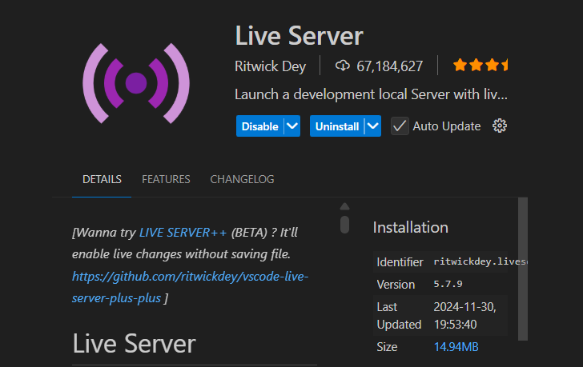
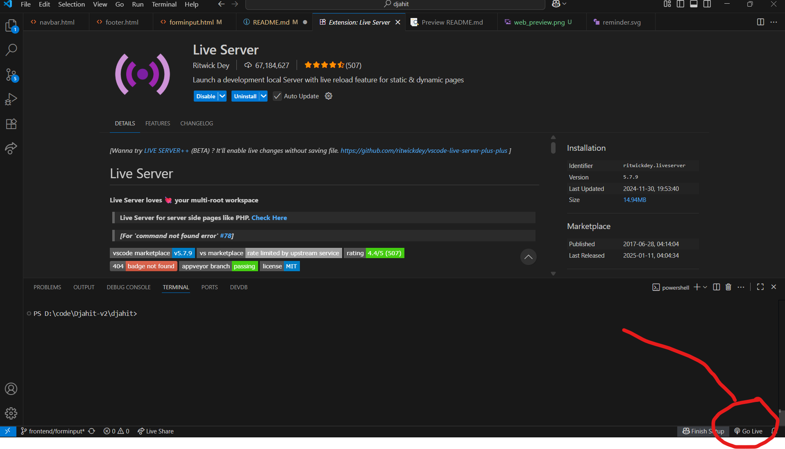

# **Djahit**
**Djahit** is a SaaS platform that connects users with local tailors for clothing repairs and alterations. **Djahit makes online** **booking easy** while promoting sustainability and supporting **small and medium-sized enterprises (SMEs)**. 


## Here are the steps you need to follow to run our code on your device ->

1. Make sure you have VS Code or your preferred text editor installed.  
2. Open VS Code, go to the terminal, and run the git clone command using our repository:  
   ```
    git clone https://github.com/CheeseBurrrrger/djahit.git
   ```  
3. After successfully cloning the repository, go to the Extensions tab and search for "Live Server".  
> Below is the extension

 
>
>

4. Install the Live Server extension.  
5. Once the extension is installed, you'll see a "Go Live" button at the bottom of the window—click it. 

6. When the Live Server starts running, you will be automatically directed to the *profile.html* page.  
7. The page should then appear exactly as shown in the image provided below.


> Below is the actual appearance of our website, specifically the input form page.


>_That's it, Thank you and i hope you have good day._ 
_here is cute cat gif_


